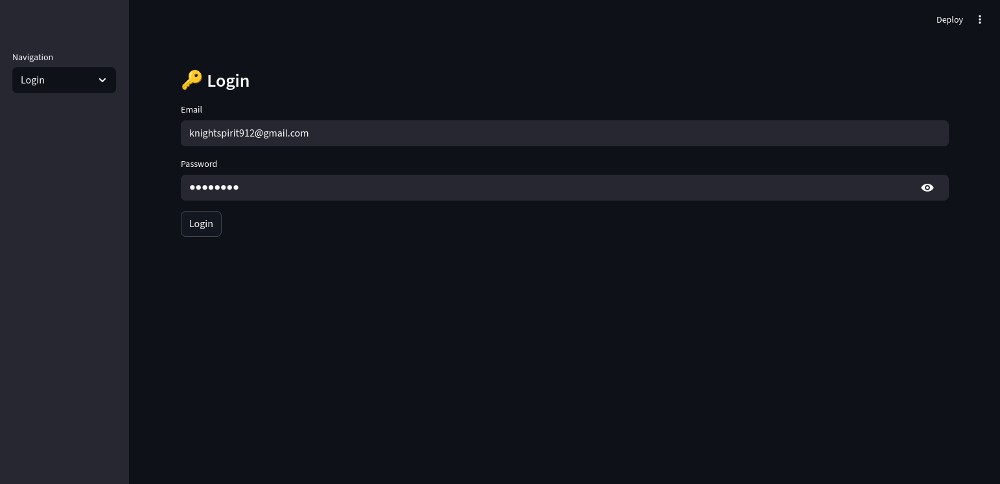
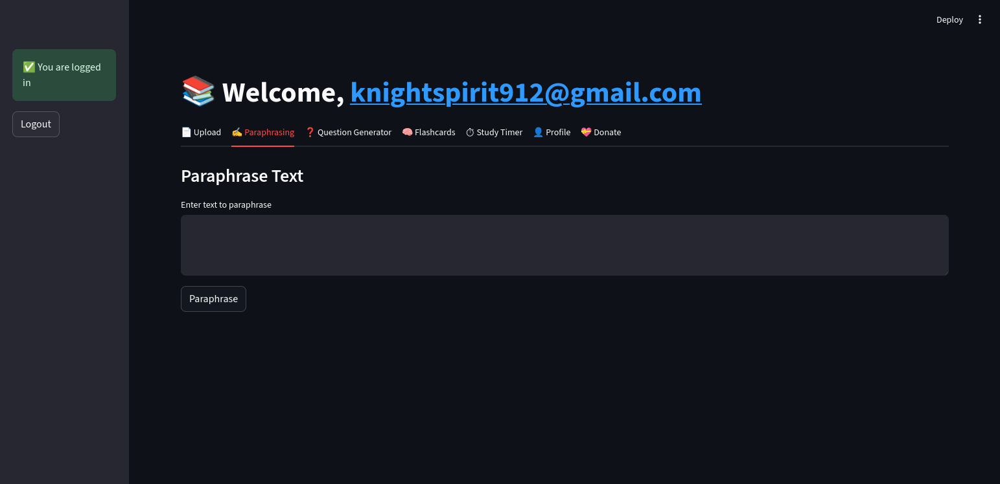
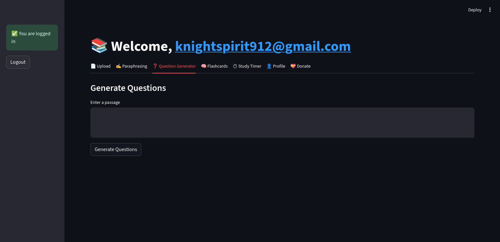
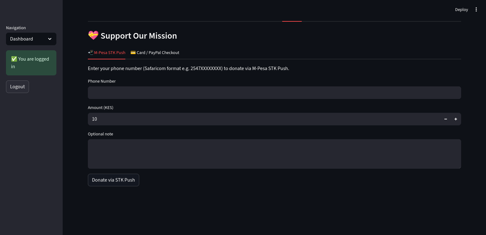
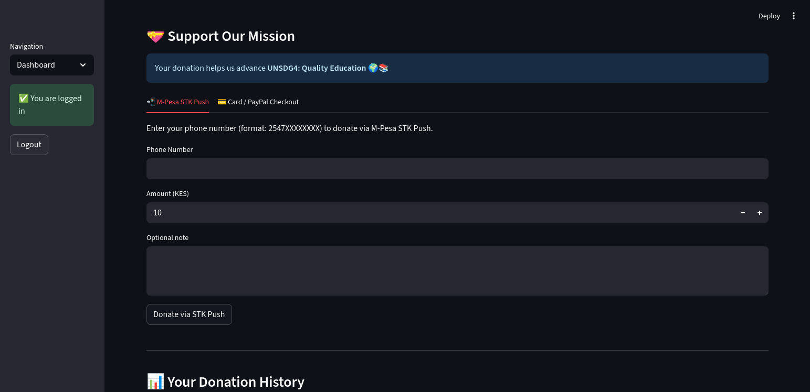
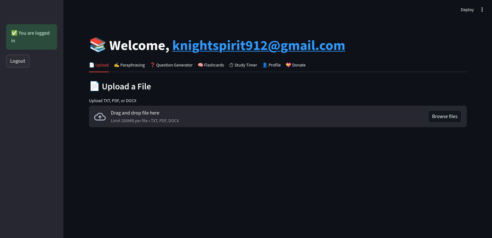
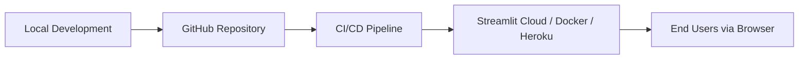

# 📘 UNSDG Goal 4 – QuBit_Learn App

[](https://streamlit.io/)
[](https://www.python.org/)
[](LICENSE)
[](https://sdgs.un.org/goals/goal4)
[](#-deployment)

---

## 🌍 Overview

This project is a **Qubit\_Learn application** designed to support **United Nations Sustainable Development Goal (SDG) 4: Quality Education**.

The app empowers **policymakers, educators, researchers, and students** to:

* Explore and analyze education-related datasets.
* Visualize key indicators like **literacy rates, enrollment ratios, and completion rates**.
* Upload custom datasets for tailored analysis.
* Generate downloadable reports (PDF/CSV).

By making education data **accessible, interactive, and actionable**, the app contributes to **inclusive and equitable quality education for all**.

---

## 🚀 Live Demo

👉 Try the app here: [**Live Demo on Streamlit Cloud**](https://qubit-learn.onrender.com/)

---

## 🖼️ Screenshots

* **Login**
  

* **Paraphraser**
  

  * **Dashboard**
  

* **Support_Mission**
  

* **Donate**
  

* **Upload Files**
  


---

## 🏗️ Architecture

### 🔹 Project Structure

```bash
QUBit_Learn/
│
├── app.py                  # Main Streamlit entry point
├── components/             # Multi-page Streamlit apps
│   ├── dashboard.py
│   ├── flashcard_display.py
│   ├── login_form.py
│
├── tests/                  # Tests
│   ├── test_auth.py
│   └── test_database.py
│
├── src/                    # Helper functions
│   ├── ai_processor.py
│   ├── auth.py
│   ├── database.py
│   └── flashcard_generator.py
│
├── docs/                   # App documentation
│   ├── deployment_guide.md
│   ├── user_guide.md
│   └── architecture.md
│
├── requirements.txt        # Dependencies
└── README.md               # Documentation
```

---

## 📖 User Guide

### 1. Accessing the App

* Run locally with:

  ```bash
  streamlit run app.py
  ```
* Open [http://localhost:8501](http://localhost:8501) in your browser.

### 2. Navigation

* **Dashboard** → View key education indicators.
* **Login** →Login Page.
* **Upload** → Upload `.docx` datasets for custom analysis.
* **Visualization Tools** → Explore trends using interactive charts.
* **Reports** → Export insights as PDF/CSV.

### 3. Usage Steps

1. First Register and wait for a verification email to be sent to your email
2. Verify your emsil the login to your account
3. Your Dashboard where you'll be able to track your progress
4. (Optional) Upload your own dataset or Type a text in your Upload page.
5. Generate a **Flashcards** for offline use.

---

## 🎯 SDG Alignment

This project aligns with **SDG 4: Quality Education** by making education data accessible and actionable.

| **SDG 4 Target**                                 | **Project Contribution**                      |
| ------------------------------------------------ | --------------------------------------------- |
| **4.1**: Universal primary & secondary education | Tracks enrollment & completion rates          |
| **4.3**: Equal access to higher education        | Compares access across countries/regions      |
| **4.5**: Eliminate gender disparities            | Highlights gender-based differences           |
| **4.6**: Universal literacy                      | Visualizes literacy trends                    |
| **4.a**: Safe & inclusive learning environments  | Identifies gaps in resources & infrastructure |

👉 Broader connections: also contributes indirectly to **SDG 5 (Gender Equality)** and **SDG 10 (Reduced Inequalities)**.

---

## 🌐 Deployment

### Local Deployment

```bash
# 1. Clone the repository
git clone https://github.com/CyberPsychiatrist/Qubit_Learn.git
cd QubitLearn

# 2a. (Option A) Create and activate a Python virtual environment
python3 -m venv venv
source venv/bin/activate   # On macOS/Linux
venv\Scripts\activate      # On Windows

# 2b. (Option B) Create and activate a Conda environment
conda create -n qubitlearn python=3.9 -y
conda activate qubitlearn

# 3. Install dependencies
pip install -r requirements.txt

# 4. Run backend first(Local Development)
cd backend
uvicorn backend:app --reload --host 127.0.0.1 --port 8000


# 4. Run the app
streamlit run app.py
```

### Cloud Deployment Options

* **Streamlit Cloud** → Connect GitHub repo for one-click deployment.

#### Deployment Flow



---

## 🤝 Contributing

Contributions are welcome! To contribute:

1. Fork the repo
2. Create a branch (`git checkout -b feature-name`)
3. Commit changes (`git commit -m "Add feature"`)
4. Push to branch (`git push origin feature-name`)
5. Open a Pull Request

---

## 📜 License

This project is licensed under the **MIT License**.

---

✨ With this application, we take a step closer toward achieving **inclusive, equitable, and quality education for all**.

---