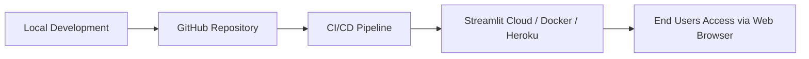

# 🏗️ Project Architecture – UNSDG Goal 4 Streamlit App

This document explains the architecture of the **UNSDG Goal 4 (Quality Education) Interactive Application**, including its **system design, data flow, and deployment pipeline**. The app is designed to be modular, scalable, and intuitive for users analyzing education-related data.

---
## 🔹 Component Overview

### 1. **Streamlit UI (Frontend)**

* Provides sidebar navigation and widgets.
* Pages:

  * 📊 Dashboard
  * 🌍 Country/Region Analysis
  * 📂 Data Upload
  * 📈 Visualization Tools
  * 📑 Reports

### 2. **App Logic (Backend)**

* Written in **Python**.
* Handles data preprocessing, filtering, and analysis.
* Computes KPIs (e.g., literacy rates, enrollment, completion ratios).

### 3. **Data Layer**

* **Local Datasets** → Preloaded CSVs.
* **External APIs** → Optional (UNESCO, World Bank).
* **User Uploads** → Custom CSV input.

### 4. **Visualization Engine**

* **Plotly / Altair** for interactive charts.
* **Geopandas + Plotly Maps** for geospatial data.

### 5. **Report Module**

* Exports analysis as **PDF** or **CSV**.
* Includes charts, KPIs, and selected insights.
---

## 🔹 Deployment Architecture

* Developers push code to **GitHub**.
* CI/CD automates testing & deployment.
* Hosted on **Streamlit Cloud** (or Docker/Heroku).
* Users access via browser, no installation needed.

---

## 🔹 Scalability & Future Roadmap

* 📦 Integrate **databases** (PostgreSQL, MongoDB) for large-scale storage.
* 🔌 Add **real-time APIs** for live education statistics.
* 🔐 Implement **authentication & user roles** for secure access.
* 🤖 Use **AI-powered insights** for automated recommendations.
* ☁️ Expand deployment to **Kubernetes / AWS / Azure** for enterprise scalability.

---

✨ This architecture ensures the app is **modular, maintainable, and ready for scaling**, while staying user-friendly for policy makers, researchers, and students.

---
