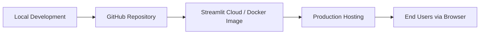

=---

# 🏗️ Project Architecture – QUBit\_Learn App

This document describes the **system architecture** of the **QUBit\_Learn App**, a Streamlit-based application aligned with **UNSDG Goal 4 (Quality Education)**.

---

## 🔹 Project Structure

```bash
QUBit_Learn/
│
├── app.py                  # Main Streamlit entry point
│
├── components/             # Multi-page app components
│   ├── dashboard.py
│   ├── flashcard_display.py
│   ├── login_form.py
│
├── src/                    # Core logic and helpers
│   ├── ai_processor.py
│   ├── auth.py
│   ├── database.py
│   └── flashcard_generator.py
│
├── tests/                  # Unit tests
│   ├── test_auth.py
│   └── test_database.py
│
├── docs/                   # Documentation
│   ├── architecture.md
│   ├── deployment_guide.md
│   └── user_guide.md
│
├── requirements.txt        # Python dependencies
└── README.md               # Main project documentation
```

---

## 🔹 Key Components

### 1. **Frontend (Streamlit UI)**

* Sidebar navigation
* Dashboards & charts
* User authentication (login form)

### 2. **Backend (Application Logic)**

* Authentication (`auth.py`)
* Data processing (`database.py`, `ai_processor.py`)
* Flashcard generation (`flashcard_generator.py`)

### 3. **Data Sources**

* Preloaded educational datasets
* User-uploaded CSVs
* Potential integration with **UNESCO, UNICEF, or World Bank APIs**

### 4. **Visualization**

* Interactive plots (via **Matplotlib / Plotly / Altair**)
* Comparative dashboards (e.g., country vs. region)

### 5. **Reporting**

* PDF/CSV generation
* Custom report export for policymakers and researchers

---

## 🔹 Deployment Architecture



* **Local Development**: Python virtualenv or Conda.
* **CI/CD**: Optional GitHub Actions for automated testing & deployment.
* **Production**: Hosted on **Streamlit Cloud**, Docker, or cloud providers (AWS, Azure, GCP).

---

## ✨ Summary

The **QUBit\_Learn App** follows a **modular architecture**:

* Lightweight frontend with **Streamlit**.
* Scalable backend with **Python modules**.
* Flexible data handling (local, uploads, APIs).
* Rich analytics via **interactive visualizations & reporting**.
* AI-driven **flashcard generator** to enhance learning.

This design ensures the app is **extensible, maintainable, and aligned with UNSDG Goal 4**.

---
